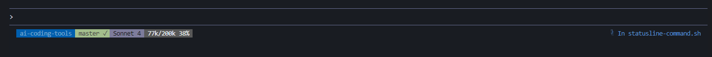

# AI Coding Tools

A collection of configurations, prompts, and tools that I use to enhance my AI-assisted development workflow.

## Claude Code Configurations

Custom configurations for [Claude Code](https://claude.com/claude-code).

### Status Line

Custom status line that provides real-time context awareness and project visibility.

#### Features

The custom status line provides at-a-glance information about your development session:

- **Project name** - Current working directory
- **Git status** - Branch name and working tree state (clean ✓ or dirty ●)
- **Model information** - Currently active Claude model (Sonnet 4, Opus, etc.)
- **Context usage** - Token usage with intelligent buffer calculations and color-coded warnings



The status line uses color coding to communicate state:
- **Green** git indicator = clean working tree
- **Red** git indicator = uncommitted changes
- **Gray** context indicator = normal usage (<90%)
- **Yellow** context indicator = approaching auto-compact (90-94%)
- **Red** context indicator = auto-compact imminent (≥95%)

#### Installation

1. **Copy settings configuration:**
   ```bash
   cp claude/settings.json ~/.claude/settings.json
   ```
> **Note:** Ensure that the `"command"` path in `claude/settings.json` matches the location where you'll install `statusline-command.sh`.

1. **Install the status line script:**
   ```bash
   cp claude/statusline-command.sh ~/.claude/statusline-command.sh
   chmod +x ~/.claude/statusline-command.sh
   ```

2. **Restart Claude Code** to apply the new configuration.

#### How It Works

**`settings.json`**
- Enables the custom status line command (ensure that the path to the statusline-command.sh is correct)
- Activates extended thinking mode for better reasoning

**`statusline-command.sh`**
- Parses Claude Code's session data (workspace, model, transcript)
- Calculates real-time context usage from the transcript JSONL file
- Includes a 22.5% auto-compact buffer to match `/context` command behavior
- Renders a powerline-style status bar with ANSI color codes
- Integrates git status checking for branch and working tree state

The context calculation accounts for:
- Input tokens
- Cache read tokens
- Cache creation tokens
- Auto-compact buffer (~45k tokens for 200k limit)

This gives you an accurate representation of when Claude Code will trigger auto-compact, helping you manage context proactively.

---

## Prompts

Curated prompts and reference documents for AI-assisted development.

### Design Principles

**File:** [`prompts/design/design_principles.md`](prompts/design/design_principles.md)

A comprehensive reference document covering fundamental design and accessibility principles for building high-quality software interfaces.

#### What's Included

This document consolidates four essential frameworks:

1. **Dieter Rams' 10 Principles of Good Design**
   - Originally for physical products, adapted for software
   - Emphasizes innovation, utility, aesthetics, clarity, and minimalism
   - Includes practices, watch-outs, and team checklists

2. **Ben Shneiderman's Eight Golden Rules of Interface Design**
   - Focus on consistency, shortcuts, feedback, and error handling
   - Practical heuristics for design reviews
   - Instrumentation and quality gate recommendations

3. **Nielsen's 10 Usability Heuristics**
   - System visibility, user control, error prevention
   - Recognition over recall, flexibility and efficiency
   - Includes design review checklists and metrics guidance

4. **WCAG 2.0 Accessibility Guidelines**
   - POUR principles (Perceivable, Operable, Understandable, Robust)
   - AA conformance targets with concrete examples
   - Engineering-friendly acceptance criteria and testing strategies

---

## License

MIT - Feel free to use, modify, and share.
